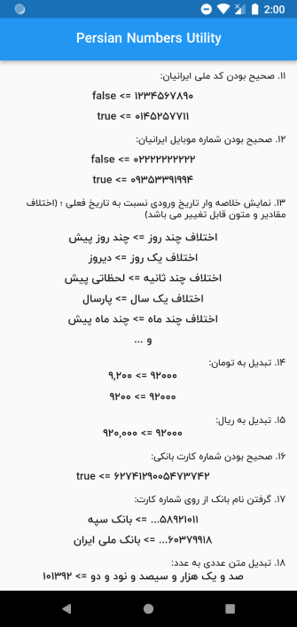

# A Flutter Package for convert number to English or Persian (Farsi) letter and convert Miladi to Persian Date(Jalali/Shamsi date) and digits validator

A Flutter Package for convert number to English or Persian (Farsi) letter and allow you to separate an integer by comma (or other) for every three digits , extract number from string and convert Miladi date to Shamsi date, Afghan month, Checking the validity of the Iranian National Code and bank number and phone number, convert price to Rial or Toman

پکیجی برای تبدیل اعداد به حروف فارسی یا انگلیسی ، همچنین برای جدا سازی سه رقمی ارقام ، جداسازی ارقام از متن ، تبدیل تاریخ شمسی به میلادی، تبدیل به ماه های افغانستانی، بررسی اعتبار کد ملی ، شماره کارت بانکی و شماره موبایل ایرانیان ، تبدیل قیمت به تومان و ریال

See the [Dart packages](https://pub.dev/packages/persian_number_utility).

## Screenshot

 

## امکانات پکیج
- [تبدیل عدد به حروف فارسی](#تبدیل-عدد-به-حروف-فارسی)
- [تبدیل عدد به حروف انگلیسی](#تبدیل-عدد-به-حروف-انگلیسی)
- [تبدیل حروف به عدد](#تبدیل-حروف-به-عدد)
- [جدا سازی سه رقمی ارقام](#جدا-سازی-سه-رقمی-ارقام)
- [جدا سازی اعداد از رشته](#جدا-سازی-اعداد-از-رشته)
- [تبدیل اعداد از انگلیسی به فارسی و بالعکس](#تبدیل-اعداد-از-انگلیسی-به-فارسی-و-بالعکس)
- [تشخیص عددی بودن متن](#تشخیص-عددی-بودن-متن)
- [تبدیل تاریخ میلادی به شمسی](#تبدیل-تاریخ-میلادی-به-شمسی)
- [تبدیل تاریخ میلادی به تاریخ شمسی از متن](#تبدیل-تاریخ-میلادی-به-تاریخ-شمسی-از-متن)
- [تبدیل تاریخ میلادی به تاریخ متنی شمسی](#تبدیل-تاریخ-میلادی-به-تاریخ-متنی-شمسی)
- [نمایش خلاصه وار تاریخ نسبت به تاریخ فعلی](#نمایش-خلاصه-وار-تاریخ-نسبت-به-تاریخ-فعلی)
- [اعتبارسنجی کد ملی ایرانیان](#اعتبارسنجی-کد-ملی-ایرانیان)
- [اعتبار سنجی شماره موبایل ایرانیان](#اعتبار-سنجی-شماره-موبایل-ایرانیان)
- [تبدیل به تومان و ریال](#تبدیل-به-تومان-و-ریال)
- [اعتبار سنجی کارت بانکی](#اعتبار-سنجی-کارت-بانکی)
- [تشخیص نام بانک از شماره کارت بانکی](#تشخیص-نام-بانک-از-شماره-کارت-بانکی)


## طریقه استفاده

خط زیر را به فایل pubspec.yaml اضافه کنید:

```yaml
dependencies:

persian_number_utility: ^1.1.0
```

خط زیر رو به ایپورت های صفحه خود اضافه کنید

```dart

import  'package:persian_number_utility/persian_number_utility.dart';

```


#### تبدیل عدد به حروف فارسی

```dart
Text("100092".toWord()),//صد هزار و نود و دو
```

#### تبدیل عدد به حروف انگلیسی

```dart
Text("100092".toWord(lang: NumStrLanguage.English)),//one hundred thousand ninety two
```


#### تبدیل حروف به عدد

```dart
Text('صد و یک هزار و سیصد و نود و دو'.toNumber().toString()), // 101392
```

#### جدا سازی سه رقمی ارقام

```dart
Text("100092".seRagham()),//100,092
Text("100092".seRagham(separator: "-")),//100-092
```

#### جدا سازی اعداد از رشته

```dart
Text("123456+.abc".extractNumber()),//۱۲۳۴۵۶
Text("number123456اب ج -".extractNumber(toDigit: NumStrLanguage.English)),//123456
```

#### تبدیل اعداد از انگلیسی به فارسی و بالعکس

```dart
Text("123456789".toPersianDigit()),//۱۲۳۴۵۶۷۸۹
Text("۱۲۳۴۵۶۷۸۹".toEnglishDigit()),//123456789
```

#### تشخیص عددی بودن متن

```dart
Text("100092".isNumeric().toString()),//true
Text("100092aaa".isNumeric().toString()),//false
```

#### تبدیل تاریخ میلادی به شمسی

```dart
Text(DateTime.now().toPersianDate()),//۱۳۹۹/۷/۶
Text(DateTime.now().toPersianDate(twoDigits: true)),//۱۳۹۹/۰۷/۰۶
```

#### تبدیل تاریخ میلادی به تاریخ شمسی از متن

```dart
Text("2020-10-07T07:47:03.233Z".toPersinaDate()),//۱۳۹۹/۷/۶
```

#### تبدیل تاریخ میلادی به تاریخ متنی شمسی

```dart
Text(DateTime.now().toPersianDateStr(strDay: true,strMonth: true)),// شانزده مهر  ۱۳۹۹
Text(DateTime.now().toPersianDateStr(showDayStr: true)),//چهارشنبه ۱۶ مهر  ۱۳۹۹
Text(DateTime.now().toPersianDateStr(strDay: true, strMonth: true, useAfghaniMonthName: true,)),//شانزده حوت ۱۳۹۹
```


#### اعتبارسنجی کد ملی ایرانیان

```dart
Text('1234567890'.isValidIranianNationalCode().toString()), // false
Text('2220042944'.isValidIranianNationalCode().toString()), // true
```

#### اعتبار سنجی شماره موبایل ایرانیان

```dart
Text('01112223344'.isValidIranianMobileNumber().toString()), // false
Text('09353391994'.isValidIranianMobileNumber().toString()), // true
Text('+989353391994'.isValidIranianMobileNumber().toString()), // true
Text('00989353391994'.isValidIranianMobileNumber().toString()), // true
```

#### نمایش خلاصه وار تاریخ نسبت به تاریخ فعلی

```dart
//Text(تاریخ و زمان مورد نظر شما .getDifferenceDateString().getDifferenceDateString())
Text(DateTime.now().add(Duration(seconds: -1)).getDifferenceDateString()),//لحظاتی پیش
Text(DateTime.now().add(Duration(seconds: -40)).getDifferenceDateString(aFewSecondsAgoText: "همین الان")),//همین الان
Text(DateTime.now().add(Duration(days: -6)).getDifferenceDateString()),//چند روز پیش
Text(DateTime.now().add(Duration(days: -1)).getDifferenceDateString()),//دیروز
Text(DateTime.now().add(Duration(days: -365)).getDifferenceDateString()),//سال پیش
Text(DateTime.now().add(Duration(days: -365)).getDifferenceDateString(lastYearText: "پارسال")),//پارسال
Text(DateTime.now().add(Duration(days: -78)).getDifferenceDateString())//چند ماه پیش
```

#### تبدیل به تومان و ریال

```dart
Text('1200'.beToman()), // 12000
Text('1200'.beRial()), // 120
```

#### اعتبار سنجی کارت بانکی

```dart
Text('1232234543212345'.isValidBankCardNumber().toString()), // false
```

#### تشخیص نام بانک از شماره کارت بانکی

```dart
Text('58921011...'.getBankNameFromCardNumber()), // بانک سپه
Text('60379911...'.getBankNameFromCardNumber()), // بانک ملی
Text('00000000...'.getBankNameFromCardNumber()), // -
```


## حمایت از ما

⭐️ در پایان اگه **خوشتون** اومده بود و **کارتون رو راه انداخت** بهش **ستاره** بدین و **لایکش** کنین 🙏🙏

[لینک گیت هاب پکیج](https://pub.dev/packages/persian_number_utility)

[لینک پکیج دارت pub.dev](https://pub.dev/packages/persian_number_utility) 
