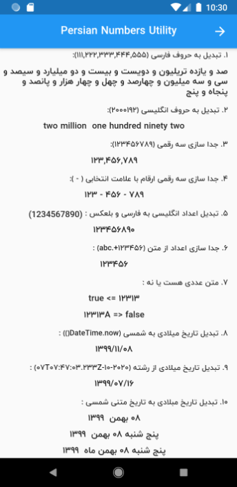
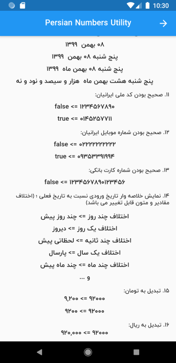

# A Flutter Package for convert number to English or Persian (Farsi) letter and convert Miladi to Persian Date(Jalali/Shamsi date) and digits validator

A Flutter Package for convert number to English or Persian (Farsi) letter and allow you to separate an integer by comma (or other) for every three digits , extract number from string and convert Miladi date to Shamsi date, Afghan month, Checking the validity of the Iranian National Code and bank number and phone number, convert price to Rial or Toman

پکیجی برای تبدیل اعداد به حروف فارسی یا انگلیسی ، همچنین برای جدا سازی سه رقمی ارقام ، جداسازی ارقام از متن ، تبدیل تاریخ شمسی به میلادی، تبدیل به ماه های افغانستانی، بررسی اعتبار کد ملی ، شماره کارت بانکی و شماره موبایل ایرانیان ، تبدیل قیمت به تومان و ریال

See the [Dart packages](https://pub.dev/packages/persian_number_utility).

## Screenshot

 

## Usage

Add it to your pubspec.yaml file:

```yaml
dependencies:

persian_number_utility: ^0.3.2
```

In your library add the following import:

```dart

import  'package:persian_number_utility/persian_number_utility.dart';

```

Here is an example how to use:

```dart

import 'package:flutter/material.dart';
import 'package:persian_number_utility/persian_number_utility.dart'; //import

class NumToStr extends StatelessWidget {
  @override
  Widget build(BuildContext context) {
    return Scaffold(
        body: Center(
            child: Column(
      crossAxisAlignment: CrossAxisAlignment.center,
      mainAxisAlignment: MainAxisAlignment.center,
      mainAxisSize: MainAxisSize.max,
      children: <Widget>[

        //تبدیل عدد به حروف فارسی - convert number to persian (farsi) letter
        Text("100092".toWord()),//صد هزار و نود و دو

        //تبدیل عدد به حروف انگلیسی - convert number to english letter
        Text("100092".toWord(lang: NumStrLanguage.English)),//one hundred thousand ninety two

        //رشته ورودی عددی هست یا نه - string is numeric or not
        Text("100092".isNumeric().toString()),//true

        //جدا سازی سه رقمی ارقام با ویرگول - separate an integer by comma for every three digits
        Text("100092".seRagham()),//100,092

        //جدا سازی سه رقمی ارقام با علامت انتخابی - separate an integer by custom character for every three digits
        Text("100092".seRagham(separator: ".")),//100.092

        //تبدیل اعداد انگلیسی به فارسی - convert english digit to persian digit
        Text("123456789".toPersianDigit()),//123456789 to ۱۲۳۴۵۶۷۸۹

        //تبدیل اعداد فارسی یا عربی به انگلیسی - convert persian/arabic digit to english digit
        Text("۱۲۳۴۵۶۷۸۹".toEnglishDigit()),//۱۲۳۴۵۶۷۸۹ to 123456789

        //جدا سازی اعداد از رشته - extract number from string
        Text("123456+.abc".extractNumber()),//۱۲۳۴۵۶

        //جدا سازی اعداد از رشته - extract number from string
        Text("number123456اب ج -".extractNumber(toDigit: NumStrLanguage.English)),//123456

        //صحیح بودن کد ملی ایرانیان - Checking the validity of the Iranian National Code
        Text('1234567890'.isValidIranianNationalCode().toString()), // false

        //صحیح بودن شماره کارت بانکی - Bank number validation
        Text('1232234543212345'.isValidBankCardNumber().toString()), // false

        //صحیح بودن شماره موبایل ایرانیان - Checking the validity of the Iranian mobile number
        Text('09353391994'.isValidIranianMobileNumber().toString()), // true
        Text('+989353391994'.isValidIranianMobileNumber().toString()), // true
        Text('00989353391994'.isValidIranianMobileNumber().toString()), // true

        //تبدیل به تومان
        Text('1200'.beToman()), // 12000
        //تبدیل به ریال
        Text('1200'.beRial()), // 120

        //_______________________ تبدیل تاریخ __________________________

        //تبدیل تاریخ میلادی به تاریخ شمسی
        Text(DateTime.now().toPersianDate()),//۱۳۹۹/۰۷/۱۶

        //تبدیل تاریخ میلادی به تاریخ شمسی از متن
        Text("2020-10-07T07:47:03.233Z".toPersinaDate()),//۱۳۹۹/۰۷/۱۶

        //تبدیل تاریخ میلادی به متن تاریخ شمسی
        Text(DateTime.now().toPersianDateStr(strDay: true,strMonth: true)),// شانزده مهر  ۱۳۹۹
        Text(DateTime.now().toPersianDateStr(showDayStr: true)),//چهارشنبه ۱۶ مهر  ۱۳۹۹
        Text(DateTime.now().toPersianDateStr(strDay: true, strMonth: true, useAfghaniMonthName: true,)),//شانزده حوت ۱۳۹۹

        //نمایش اختلاف بین دو تاریخ به صورت خلاصه وار و متنی
        Text(DateTime.now().add(Duration(seconds: -1)).getDifferenceDateString()),//لحظاتی پیش
        Text(DateTime.now().add(Duration(seconds: -40)).getDifferenceDateString(aFewSecondsAgoText: "همین الان")),//همین الان
        Text(DateTime.now().add(Duration(days: -6)).getDifferenceDateString()),//چند روز پیش
        Text(DateTime.now().add(Duration(days: -1)).getDifferenceDateString()),//دیروز
        Text(DateTime.now().add(Duration(days: -365)).getDifferenceDateString()),//سال پیش
        Text(DateTime.now().add(Duration(days: -365)).getDifferenceDateString(lastYearText: "پارسال")),//پارسال
        Text(DateTime.now().add(Duration(days: -78)).getDifferenceDateString())//چند ماه پیش
      ],
    )));
  }
}


```

## حمایت از ما

⭐️ در پایان اگه **خوشتون** اومده بود و **کارتون رو راه انداخت** بهش **ستاره** بدین و **لایکش** کنین 🙏

## Getting Started

This project is a starting point for a Dart
[package](https://flutter.dev/developing-packages/),
a library module containing code that can be shared easily across
multiple Flutter or Dart projects.

For help getting started with Flutter, view our
[online documentation](https://flutter.dev/docs), which offers tutorials,
samples, guidance on mobile development, and a full API reference.
