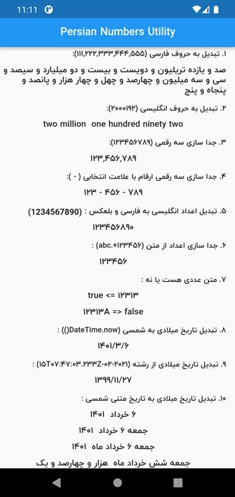
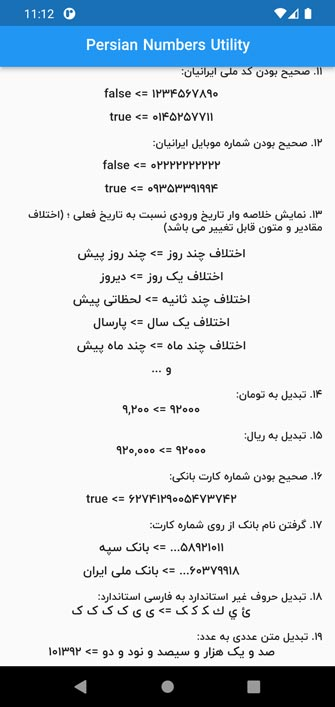

# A Flutter Package for convert number to English or Persian (Farsi) letter and convert Miladi to Persian Date(Jalali/Shamsi date) and digits validator

A Flutter Package for convert number to English or Persian (Farsi) letter and allow you to separate an integer by comma (or other) for every three digits , extract number from string and convert Miladi date to Shamsi date, Afghan month, Checking the validity of the Iranian National Code and bank number and phone number, convert price to Rial or Toman

پکیجی برای تبدیل اعداد به حروف فارسی یا انگلیسی ، همچنین برای جدا سازی سه رقمی ارقام ، جداسازی ارقام از متن ، تبدیل تاریخ شمسی به میلادی، تبدیل به ماه های افغانستانی، بررسی اعتبار کد ملی ، شماره کارت بانکی و شماره موبایل ایرانیان ، تبدیل قیمت به تومان و ریال

See the [Dart packages](https://pub.dev/packages/persian_number_utility).

## Screenshot

 

## امکانات پکیج
- [تبدیل عدد به حروف فارسی - Convert numbers to Persian letters](#تبدیل-عدد-به-حروف-فارسی)
- [تبدیل عدد به حروف انگلیسی - Convert numbers to English letters](#تبدیل-عدد-به-حروف-انگلیسی)
- [تبدیل حروف به عدد - Convert letters to numbers](#تبدیل-حروف-به-عدد)
- [جدا سازی سه رقمی ارقام - Three-digit separation of digits](#جدا-سازی-سه-رقمی-ارقام)
- [جدا سازی چهار رقمی ارقام - Four-digit separation of digits](#جدا-سازی-چهار-رقمی-ارقام)
- [جدا سازی اعداد از رشته - Separate numbers from strings](#جدا-سازی-اعداد-از-رشته)
- [تبدیل اعداد از انگلیسی به فارسی و بالعکس - Convert digits from English to Persian and vice versa](#تبدیل-اعداد-از-انگلیسی-به-فارسی-و-بالعکس)
- [تشخیص عددی بودن متن - Recognize the numerical nature of the text](#تشخیص-عددی-بودن-متن)
- [تبدیل تاریخ میلادی به شمسی - Convert Gregorian date to Shamsi date](#تبدیل-تاریخ-میلادی-به-شمسی)
- [تبدیل تاریخ میلادی به تاریخ شمسی از متن - Convert Gregorian date to Shamsi date from text](#تبدیل-تاریخ-میلادی-به-تاریخ-شمسی-از-متن)
- [تبدیل تاریخ میلادی به تاریخ متنی شمسی - Convert Gregorian date to Shamsi textual date](#تبدیل-تاریخ-میلادی-به-تاریخ-متنی-شمسی)
- [نمایش خلاصه وار تاریخ نسبت به تاریخ فعلی - Show date briefly compared to current date](#نمایش-خلاصه-وار-تاریخ-نسبت-به-تاریخ-فعلی)
- [اعتبارسنجی کد ملی ایرانیان - Validation of Iranian National Code](#اعتبارسنجی-کد-ملی-ایرانیان)
- [اعتبار سنجی شماره موبایل ایرانیان - Validation of Iranian mobile number](#اعتبار-سنجی-شماره-موبایل-ایرانیان)
- [تبدیل به تومان و ریال - Convert to Tomans and Rials](#تبدیل-به-تومان-و-ریال)
- [اعتبار سنجی کارت بانکی - Bank card validation](#اعتبار-سنجی-کارت-بانکی)
- [تشخیص نام بانک از شماره کارت بانکی - Recognize the name of the bank from the bank card number](#تشخیص-نام-بانک-از-شماره-کارت-بانکی)
- [اعتبار سنجی شماره شبا بانکی - Bank account IBAN validation](#اعتبار-سنجی-شماره-شبا-بانکی)
- [تبدیل حروف عربی به حروف استاندارد الفبای فارسی  - Convert Arabic letters to standard letters of the Persian](#تبدیل-حروف-غیر-استاندارد-به-حروف-استاندارد-الفبای-فارسی)
- [اعتبارسنجی کد پستی ایرانیان - Validation of Iranian Postal Code](#اعتبارسنجی-کد-پستی-ایرانیان)
- [تشخیص وجود عدد در رشته - String is contains digits](#تشخیص-وجود-عدد-در-رشته)


## طریقه استفاده - Usage

Add the following line to the pubspec.yaml file:

خط زیر را به فایل pubspec.yaml اضافه کنید:

```yaml
dependencies:

persian_number_utility: ^1.1.4
```

خط زیر رو به ایمپورت های صفحه خود اضافه کنید - Add the following line to your page imports

```dart

import  'package:persian_number_utility/persian_number_utility.dart';

```


#### تبدیل عدد به حروف فارسی

```dart
Text("100092".toWord()),//صد هزار و نود و دو
```

#### تبدیل عدد به حروف انگلیسی

```dart
Text("100092".toWord(lang: NumStrLanguage.English)),//one hundred thousand ninety two
```


#### تبدیل حروف به عدد

```dart
Text('صد و یک هزار و سیصد و نود و دو'.toNumber().toString()), // 101392
```

#### جدا سازی سه رقمی ارقام

```dart
Text("100092".seRagham()),//100,092
Text("100092".seRagham(separator: "-")),//100-092
```
#### جدا سازی چهار رقمی ارقام

```dart
Text("6037991123456789".charRagham()), //6037-9911-2345-6789
Text("6037-9911-2345-6789".charRagham(separator: " ")), //6037 9911 2345 6789
```

#### جدا سازی اعداد از رشته

```dart
Text("123456+.abc".extractNumber()),//۱۲۳۴۵۶
Text("number123456اب ج -".extractNumber(toDigit: NumStrLanguage.English)),//123456
```

#### تبدیل اعداد از انگلیسی به فارسی و بالعکس

```dart
Text("123456789".toPersianDigit()),//۱۲۳۴۵۶۷۸۹
Text("۱۲۳۴۵۶۷۸۹".toEnglishDigit()),//123456789
```

#### تشخیص عددی بودن متن

```dart
Text("100092".isNumeric().toString()),//true
Text("100092aaa".isNumeric().toString()),//false
```

#### تبدیل تاریخ میلادی به شمسی

```dart
Text(DateTime.now().toPersianDate()),//۱۳۹۹/۰۷/۰۶
Text(DateTime.now().toPersianDate(twoDigits: false)),//۱۳۹۹/۷/۶
Text(DateTime.now().toPersianDate(twoDigits: true,showTime: true,timeSeprator: ' - ')),//۱۳۹۹/۰۷/۰۶ - ۰۷:۳۹

//اگه نیاز بود که زمان در سمت راست یا چپ متن قرار بگیرد
Text(DateTime.now().toPersianDate(twoDigits: true,showTime: true,changeDirectionShowTimw: false)),//۰۷:۳۹ ۱۳۹۹/۰۷/۰۶ 
```

#### تبدیل تاریخ میلادی به تاریخ شمسی از متن

```dart
Text("2020-10-07T07:47:03.233Z".toPersinaDate()),//۱۳۹۹/۷/۶
```

#### تبدیل تاریخ میلادی به تاریخ متنی شمسی

```dart
Text(DateTime.now().toPersianDateStr(strDay: true,strMonth: true)),// شانزده مهر  ۱۳۹۹
Text(DateTime.now().toPersianDateStr(showDayStr: true)),//چهارشنبه ۱۶ مهر  ۱۳۹۹
Text(DateTime.now().toPersianDateStr(strDay: true, strMonth: true, useAfghaniMonthName: true,)),//شانزده حوت ۱۳۹۹
```


#### اعتبارسنجی کد ملی ایرانیان

```dart
Text('1234567890'.isValidIranianNationalCode().toString()), // false
Text('2220042944'.isValidIranianNationalCode().toString()), // true
```

#### اعتبار سنجی شماره موبایل ایرانیان

```dart
Text('01112223344'.isValidIranianMobileNumber().toString()), // false
Text('09353391994'.isValidIranianMobileNumber().toString()), // true
Text('+989353391994'.isValidIranianMobileNumber().toString()), // true
Text('00989353391994'.isValidIranianMobileNumber().toString()), // true
```

#### نمایش خلاصه وار تاریخ نسبت به تاریخ فعلی

```dart
//Text(تاریخ و زمان مورد نظر شما .getDifferenceDateString().getDifferenceDateString())
Text(DateTime.now().add(Duration(seconds: -1)).getDifferenceDateString()),//لحظاتی پیش
Text(DateTime.now().add(Duration(seconds: -40)).getDifferenceDateString(aFewSecondsAgoText: "همین الان")),//همین الان
Text(DateTime.now().add(Duration(days: -6)).getDifferenceDateString()),//چند روز پیش
Text(DateTime.now().add(Duration(days: -1)).getDifferenceDateString()),//دیروز
Text(DateTime.now().add(Duration(days: -365)).getDifferenceDateString()),//سال پیش
Text(DateTime.now().add(Duration(days: -365)).getDifferenceDateString(lastYearText: "پارسال")),//پارسال
Text(DateTime.now().add(Duration(days: -78)).getDifferenceDateString())//چند ماه پیش
```

#### تبدیل به تومان و ریال

```dart
Text('1200'.beToman()), // 12000
Text('1200'.beRial()), // 120
```

#### اعتبار سنجی کارت بانکی

```dart
Text('1232234543212345'.isValidBankCardNumber().toString()), // false
```

#### تشخیص نام بانک از شماره کارت بانکی

```dart
Text('58921011...'.getBankNameFromCardNumber()), // بانک سپه
Text('60379911...'.getBankNameFromCardNumber()), // بانک ملی
Text('00000000...'.getBankNameFromCardNumber()), // -
```
#### اعتبار سنجی شماره شبا بانکی

```dart
Text('IR111111111111111111111111'.isValidBankShebaNumber().toString()), // false
```

#### تبدیل حروف غیر استاندارد به حروف استاندارد الفبای فارسی

```dart
Text('ئ ي ك ﮑ ﮐ ﮏ'.fixPersianChars()), //ی ی ک ک ک ک

```


#### اعتبارسنجی کد پستی ایرانیان

```dart
Text('5955846418'.isValidIranianPostalCode().toString()), // true
```


#### تشخیص وجود عدد در رشته

```dart
Text('abcdefghj'.isContainDigits().toString()), // false
Text('abcdefghj3'.isContainDigits().toString()), // true
```


## حمایت از ما

⭐️ در پایان اگه **خوشتون** اومده بود و **کارتون رو راه انداخت** بهش **ستاره** بدین و **لایکش** کنین 🙏🙏

[Github link](https://github.com/mehdi-nemati/persian_number_utility)

[pub link - The official package repository for Dart and Flutter apps](https://pub.dev/packages/persian_number_utility) 
